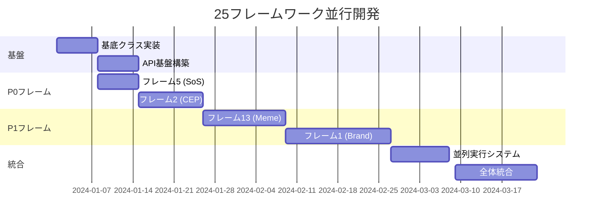

# 25フレームワーク独立開発計画

## 1. 開発アプローチ

### 1.1 モジュラー開発戦略

```
従来アプローチ (避けるべき):
全システム一気に開発 → 複雑度爆発 → デバッグ地獄

提案アプローチ:
フレームワーク1つ → 完成・テスト → 次のフレームワーク → 段階統合
```

**メリット**:
- ✅ **リスク分散**: 1つ失敗しても他に影響なし
- ✅ **早期価値提供**: 完成したフレームワークから即座に利用可能
- ✅ **並行開発**: 複数人で異なるフレームワークを同時開発
- ✅ **テスト容易性**: 独立したユニットテストが可能

### 1.2 開発優先度マトリクス

| 優先度 | フレームワーク | 理由 | 開発期間 |
|--------|---------------|------|----------|
| **P0 (即座開始)** | フレーム5: Share of Search | API単純・効果明確 | 1週間 |
| **P0** | フレーム2: CEP分布 | SNS/検索データ活用基盤 | 1.5週間 |
| **P1** | フレーム13: Meme分析 | トレンド把握・技術検証 | 2週間 |
| **P1** | フレーム1: ブランドキー | 戦略的重要性高 | 2.5週間 |
| **P2** | フレーム6: Cultural Codes | 競合分析基盤 | 3週間 |

## 2. 個別フレームワーク開発仕様

### 2.1 【最優先】フレーム5: Share of Search

**なぜ最初に？**
- Google Trends API使用で技術リスク低
- 結果が数値で分かりやすい
- 他フレームワークの基盤技術

```python
class ShareOfSearchFramework:
    """
    開発ステップ:
    1. Google Trends API接続 (1日)
    2. 競合ブランド検索量取得 (2日)
    3. シェア計算・可視化 (2日)
    4. テスト・エラーハンドリング (2日)
    """
    
    def __init__(self):
        self.framework_id = 5
        self.name = "Share of Search"
        self.estimated_dev_time = 7  # 日
        self.complexity = "LOW"
        self.dependencies = ["google-trends-api"]
    
    async def collect_data(self, input_data):
        """
        必要入力:
        - brand_name: str
        - competitors: List[str] 
        - category: str
        - time_range: str
        
        出力:
        - search_share_percentage: float
        - trend_data: List[Dict]
        - competitive_position: str
        """
        pass

# 実装例
async def implement_sos_framework():
    # Step 1: API接続テスト
    from pytrends.request import TrendReq
    pytrends = TrendReq(hl='ja-JP', tz=360)
    
    # Step 2: 検索データ取得
    keywords = ["コカコーラ", "ペプシ", "伊右衛門"]
    pytrends.build_payload(keywords, timeframe='today 12-m')
    data = pytrends.interest_over_time()
    
    # Step 3: シェア計算
    total_volume = data.sum(axis=1)
    share_data = data.div(total_volume, axis=0) * 100
    
    # Step 4: 結果構造化
    result = {
        "coca_cola_share": share_data["コカコーラ"].mean(),
        "pepsi_share": share_data["ペプシ"].mean(),
        "iyemon_share": share_data["伊右衛門"].mean(),
        "trend_direction": "increasing" if share_data["コカコーラ"].iloc[-1] > share_data["コカコーラ"].iloc[0] else "decreasing"
    }
    
    return result
```

### 2.2 フレーム2: Category Entry Points分布

**技術的特徴**:
- SNS API統合 (Twitter, Instagram)
- 自然言語処理による分類
- ヒートマップ可視化

```python
class CategoryEntryPointsFramework:
    """
    開発ステップ:
    1. SNS API統合 (3日)
    2. 投稿内容分類エンジン (4日) 
    3. Entry Points抽出 (3日)
    4. ヒートマップ生成 (1.5日)
    """
    
    def __init__(self):
        self.framework_id = 2
        self.estimated_dev_time = 11  # 日
        self.complexity = "MEDIUM"
        self.dependencies = ["twitter-api", "instagram-api", "openai-api"]
    
    async def collect_data(self, input_data):
        """
        必要入力:
        - category: str ("健康食品", "コスメ"等)
        - time_range: str ("30d", "90d")
        
        出力:
        - entry_points: List[Dict] # {"moment": "朝の忙しい時", "frequency": 234, "sentiment": 0.8}
        - heatmap_data: Dict
        - underserved_moments: List[str]
        """
        pass

# 実装アプローチ
async def implement_cep_framework():
    # Step 1: 投稿収集
    tweets = await collect_tweets_about_category("健康食品")
    instagram_posts = await collect_instagram_posts("健康食品")
    
    # Step 2: 文脈抽出
    contexts = []
    for post in tweets + instagram_posts:
        context = await extract_usage_context(post.text)  # AI分析
        contexts.append(context)
    
    # Step 3: Entry Points分類
    entry_points = categorize_entry_points(contexts)
    # {"朝の忙しい時": 342, "運動後": 156, "罪悪感を感じた時": 89}
    
    # Step 4: 機会発見
    underserved = find_underserved_moments(entry_points)
    
    return {
        "entry_points": entry_points,
        "opportunities": underserved
    }
```

### 2.3 フレーム13: Meme & Emoji Trend Scan

**なぜ重要？**
- 若年層の言語トレンド把握
- バイラルコンテンツ予測
- 表現の新奇性発見

```python
class MemeEmojiTrendFramework:
    """
    開発ステップ:
    1. TikTok API統合 (3日)
    2. ハッシュタグ・絵文字分析 (4日)
    3. バイラル度計算 (3日)
    4. トレンド予測モデル (4日)
    """
    
    def __init__(self):
        self.framework_id = 13
        self.estimated_dev_time = 14  # 日
        self.complexity = "HIGH"
        self.dependencies = ["tiktok-api", "emoji-lib", "trend-analysis"]
    
    async def collect_data(self, input_data):
        """
        必要入力:
        - platforms: List[str] ["TikTok", "Instagram", "Twitter"]
        - category_hashtags: List[str]
        - time_window: str
        
        出力:
        - trending_expressions: List[str]
        - viral_velocity: Dict[str, float]
        - usage_contexts: List[str]
        - predicted_trends: List[str]
        """
        pass

# 実装例
async def implement_meme_framework():
    # Step 1: バイラルコンテンツ収集
    tiktok_videos = await collect_tiktok_videos(hashtags=["健康", "ダイエット"])
    
    # Step 2: 言語パターン抽出
    expressions = []
    for video in tiktok_videos:
        caption_expressions = extract_expressions(video.caption)
        comment_expressions = extract_expressions(video.comments)
        expressions.extend(caption_expressions + comment_expressions)
    
    # Step 3: バイラル度計算
    viral_scores = {}
    for expr in expressions:
        viral_scores[expr] = calculate_viral_velocity(expr)
    
    # Step 4: トレンド予測
    trending = [expr for expr, score in viral_scores.items() if score > 0.7]
    
    return {
        "trending_now": trending,
        "emerging_trends": predict_emerging_trends(viral_scores)
    }
```

## 3. 段階的統合アプローチ

### 3.1 統合レベル定義

**Level 1: 独立動作**
```python
# 各フレームワークが完全独立で動作
result_sos = await ShareOfSearchFramework().collect_data(input_data)
result_cep = await CategoryEntryPointsFramework().collect_data(input_data)
```

**Level 2: 基本統合**
```python
# 複数フレームワークを並列実行
frameworks = [ShareOfSearchFramework(), CategoryEntryPointsFramework()]
results = await asyncio.gather(*[fw.collect_data(input_data) for fw in frameworks])
```

**Level 3: 高度統合**
```python
# フレームワーク間でデータ共有・相互強化
class FrameworkOrchestrator:
    async def execute_enhanced(self, input_data):
        # SoSの結果をCEPの入力として活用
        sos_result = await self.sos_framework.collect_data(input_data)
        
        # CEP分析にSoS結果を反映
        enhanced_input = {**input_data, "search_trends": sos_result.trend_data}
        cep_result = await self.cep_framework.collect_data(enhanced_input)
        
        return self.synthesize_insights([sos_result, cep_result])
```

### 3.2 統合スケジュール

**Week 1-2: 基盤構築**
- 基底クラス `FrameworkComponent` 実装
- API基盤・データベース構築
- フレーム5実装・テスト

**Week 3-4: 第1次統合**
- フレーム2, 13実装
- 3フレームワーク並列実行システム
- 基本ダッシュボード

**Week 5-8: 第2次拡張**
- フレーム1, 6, 14実装
- 6フレームワーク統合
- 相互データ活用機能

**Week 9-12: 全体統合**
- 残りフレームワーク実装
- 25フレームワーク完全統合
- 高度分析・予測機能

## 4. 開発体制・分担

### 4.1 推奨チーム構成

**【チーム A】データ基盤チーム (2名)**
- API統合エンジニア: 外部API接続・データ収集
- データエンジニア: データベース・ETL処理

**【チーム B】フレームワーク実装チーム (3名)**
- シニアエンジニア: 複雑フレームワーク (1,6,9,18等)
- ミドルエンジニア: 中級フレームワーク (2,5,13等)
- ジュニアエンジニア: 基本フレームワーク (3,4,12等)

**【チーム C】統合・UI チーム (2名)**
- バックエンドエンジニア: オーケストレーター・統合ロジック
- フロントエンドエンジニア: ダッシュボード・可視化

### 4.2 並行開発スケジュール



## 5. 成功指標・マイルストーン

### 5.1 技術指標

| 指標 | 目標値 | 測定方法 |
|------|--------|----------|
| **フレームワーク実行成功率** | >95% | 1000回実行中の成功数 |
| **平均実行時間** | <予定時間の120% | 各フレームワークの実行時間測定 |
| **並列処理効率** | >80% | 並列実行時間 vs 順次実行時間 |
| **API可用性** | >99% | HTTP ステータス監視 |

### 5.2 ビジネス指標

| 指標 | 目標値 | 測定方法 |
|------|--------|----------|
| **洞察発見数** | フレーム1つあたり3-5個 | 出力insights配列の長さ |
| **データ収集量** | 計画値の80%以上 | 収集データサイズ測定 |
| **実用性スコア** | 7.0/10以上 | 利用者評価アンケート |

### 5.3 マイルストーン

**🎯 Milestone 1 (Week 2)**
- フレーム5完成・デモ可能
- 基盤システム安定動作

**🎯 Milestone 2 (Week 4)**  
- 3フレームワーク並列動作
- 基本統合ダッシュボード

**🎯 Milestone 3 (Week 8)**
- 10フレームワーク統合
- 相互データ活用実証

**🎯 Final Milestone (Week 12)**
- 25フレームワーク完全統合
- 本格運用開始

---

この段階的開発により、**リスクを最小化**しながら**価値を最大化**する開発が可能になります！ 